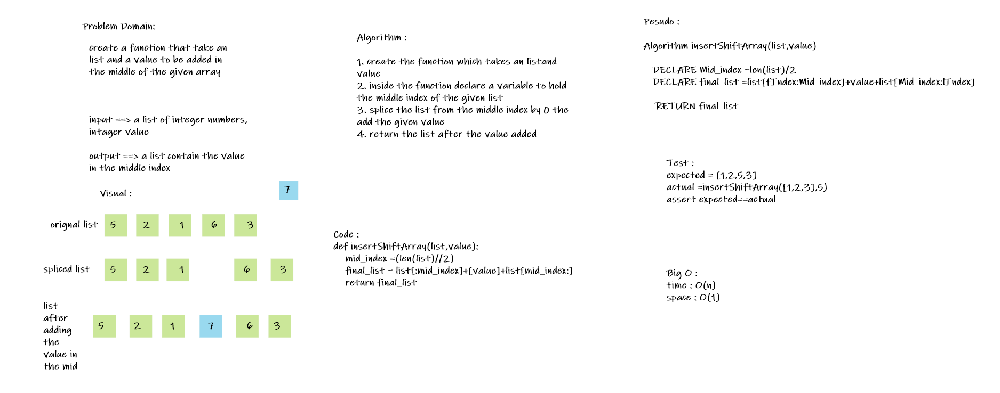

# Insert to Middle of an Array
A function that takes in an array and a value to be added in the middle of the given array

## Whiteboard Process

## Approach & Efficiency
I used a function which hole the finding middle index and slicing the given list functionality then concatenate the final list

time complexity : O(n)
space complexity :O(1)