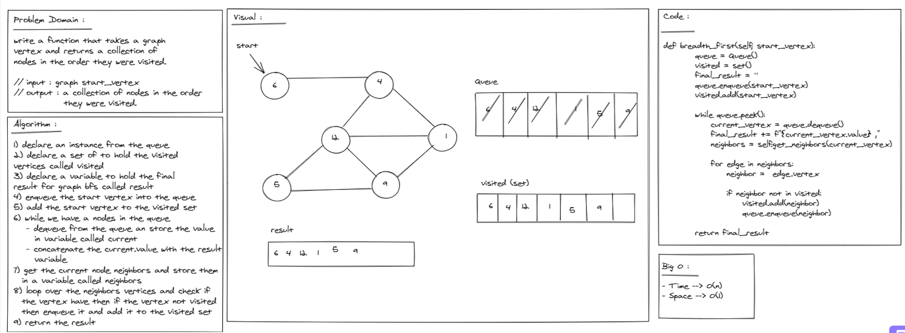

# Challenge Summary
BFS of a graph -  return collection of nodes in the order they were visited.

## Whiteboard Process

## Approach & Efficiency
- Time : O(n)
- Space : O(1)

## Solution
after cloneing the repo navigate to `python/graph ` directory then run `poetry shell` and `poerty install` then run `pytest`
