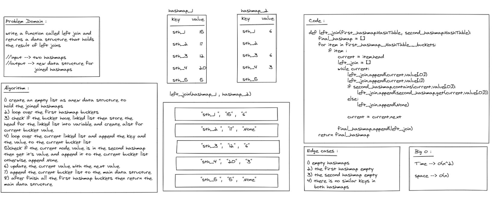

# Hashmap LEFT JOIN
returns all records from the left table (table1), and the matching records from the right table (table2). The result is 0 records from the right side, if there is no match.

**Syntax :**
```sql
SELECT column_name(s)
FROM table1
LEFT JOIN table2
ON table1.column_name = table2.column_name;
```


## Challenge
Implement a simplified LEFT JOIN for 2 Hashmaps.

- Write a function called left join
- Arguments: two hash maps
    + The first parameter is a hashmap that has word strings as keys, and a synonym of the key as values.
    + The second parameter is a hashmap that has word strings as keys, and antonyms of the key as values.
- Return: The returned data structure that holds the results is up to you. It doesn’t need to exactly match the output below, so long as it achieves the LEFT JOIN logic

## Whiteboard

## Approach & Efficiency
- Time : O(n^2)
- space : O(n^2)

## Solution
after cloneing the repo navigate to `python/hash_table ` directory then run `poetry shell` and `poerty install` then run `pytest`
