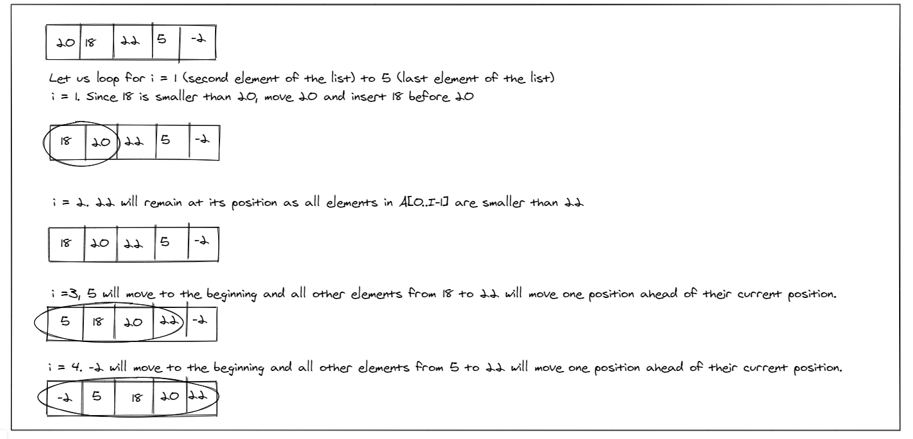

# Insertion sort
Insertion sort is a simple sorting algorithm that works similar to the way you sort playing cards in your hands. The array is virtually split into a sorted and an unsorted part. Values from the unsorted part are picked and placed at the correct position in the sorted part.

# Pseudocode
``` pseudo
InsertionSort(int[] arr)

    FOR i = 1 to arr.length

      int j <-- i - 1
      int temp <-- arr[i]

      WHILE j >= 0 AND temp < arr[j]
        arr[j + 1] <-- arr[j]
        j <-- j - 1

      arr[j + 1] <-- temp
```
# Trace
**Example :** [20,18,22,5,-2]

# Code (python) :
```python
def insertionSort(my_list):
    n = len(my_list)
    for item in range(1, n):
        j = item - 1
        temp = my_list[item]
        while j >= 0 and temp < my_list[j]:
            my_list[j+1] = my_list[j]
            j = j-1

        my_list[j+1] = temp
    return my_list
```

# Test (python) :
```python
def test_selection_sort_first_case():
    expected =[-2,5,8,12,18,20]
    arr = [20,18,12,8,5,-2]
    actual = insertionSort(arr)
    assert actual == expected

def test_selection_sort_second_case():
    expected =[5,5,5,7,7,12]
    arr = [5,12,7,5,5,7]
    actual = insertionSort(arr)
    assert actual == expected

def test_selection_sort_third_case():
    expected =[2,3,5,7,11,13]
    arr = [2,3,5,7,13,11]
    actual = insertionSort(arr)
    assert actual == expected

```
# Big O :
- Time Complexity: O(n^2)
- Space Complexity: O(1)
