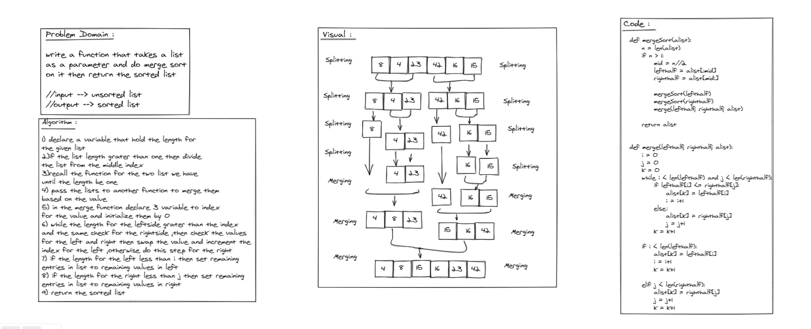

# Challenge Summary
**Merge Sort** is a Divide and Conquer algorithm. It divides the input array into two halves, calls itself for the two halves, and then merges the two sorted halves.

## Blog
[blog](blog.md)

## Whiteboard Process

## Approach & Efficiency
- Time :O(nlogn)
- space :O(1)

## Solution
after cloneing the repo navigate to `python/merge_sort ` directory then run `poetry shell` and `poerty install` then run `pytest`
