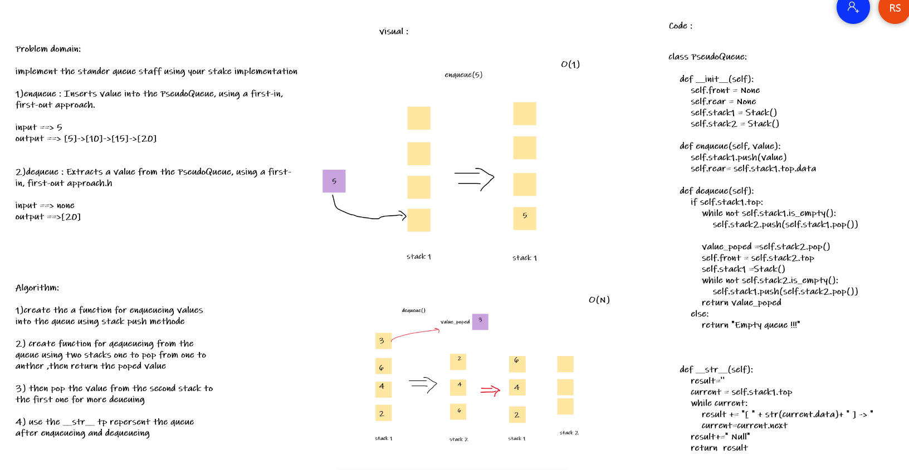

# Challenge Summary
Implememnt the Queue staff using our stack implementation

## Whiteboard Process

## Approach & Efficiency
I use class to implement the pesudoQueue ,for the enqueue I push the value to the stack and in the dequeue I pop the values from the first stack to the second one ,then I pop the value from the second stack and stored it into variable ,then I returned the value again to first stack

## Solution
Navegate to `python/code_challenge/stack_and_queue` then open the termenal and run `poetry shell` the pytest the `stack_and_queue_pesudo`
