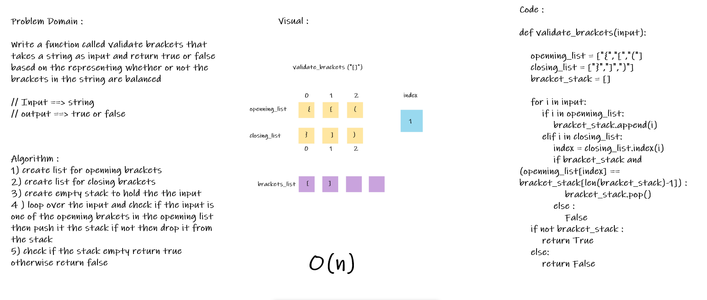

# Challenge Summary
Multi-bracket Validation.

## Whiteboard Process

## Approach & Efficiency
I use two list to hold the brakets that I want to check ,and a list to hold the input and for loop to loop over the input and check if the brackets balanced or not

time :O(n)
space : O(1)

## Solution
Navegate to `python/code_challenge/stack_and_queue` then open the termenal and run `poetry shell` the pytest the `stack_and_queue_pesudo
