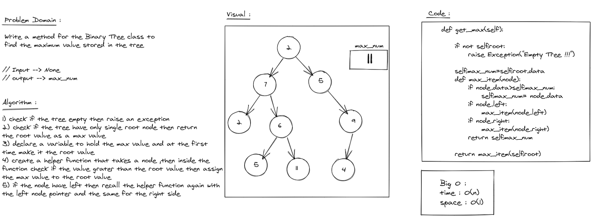
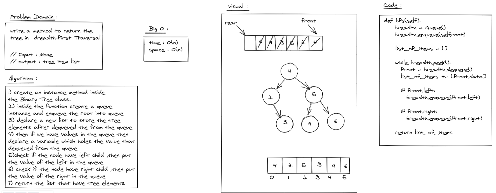

## Challenge
**Binary Tree and BST Implementation**
- Node
Create a Node class that has properties for the value stored in the node, the left child node, and the right child node.

- Binary Tree
Create a Binary Tree class
Define a method for each of the depth first traversals:

    - pre order
    - in order
    - post order which returns an array of the values, ordered appropriately.

-  Binary Search Tree
Create a Binary Search Tree class
This class should be a sub-class (or your languages equivalent) of the Binary Tree Class, with the following additional methods:
    - Add
        Arguments: value
        Return: nothing
        Adds a new node with that value in the correct location in the binary search tree.
    - Contains
        Argument: value
        Returns: boolean indicating whether or not the value is in the tree at least once.

## Approach & Efficiency
class Approach and helper function inside a function to do the recersive staff

- pr_order() -> time: O(log(n)) -- space : O(n)
- in_order() -> time: O(log(n)) -- space : O(n)
- post_order() -> time: O(log(n)) -- space : O(n)
- BFS() -> time: O(n) -- space : O(n)
- add() -> time: O(n) -- space :O(1)
- conatins() -> time: O(n) -- space :O(1)

___
# Challenge Summary
Find the maximum value stored in the tree

## Whiteboard Process

## Approach & Efficiency
I use helper function inside the get-max method to do the recaerssion staff and finding the max number

time : O(n)
space : O(1)

## Solution
Navegate to `python/code_challenge/trees` then open the termenal and run `poetry shell` the pytest the `stack_and_queue_pesudo

___
# Challenge Summary
return the tree in breadth-first Traversal

## Whiteboard Process

## Approach & Efficiency
I use a queue and a list to traversal the tree element and loop over the queue if it have elements or not

time : O(n)
space : O(n)

## Solution
Navegate to `python/code_challenge/trees` then open the termenal and run `poetry shell` the pytest the `stack_and_queue_pesudo
___
# Challenge Summary
Determine whether or not the value of each node is divisible by 3, 5 or both. Create a new tree with the same structure as the original, but the values modified as follows:

- If the value is divisible by 3, replace the value with “Fizz”
- If the value is divisible by 5, replace the value with “Buzz”
- If the value is divisible by 3 and 5, replace the value with “FizzBuzz”
- If the value is not divisible by 3 or 5, simply turn the number into a String

## Whiteboard Process

## Approach & Efficiency
I use helper function inside the  method to do the recaerssion staff and fill the new tree with `Fizz` or `Buzz` or both

time : O(n)
space : O(n)

## Solution
Navegate to `python/code_challenge/trees` then open the termenal and run `poetry shell` the pytest the `stack_and_queue_pesudo
